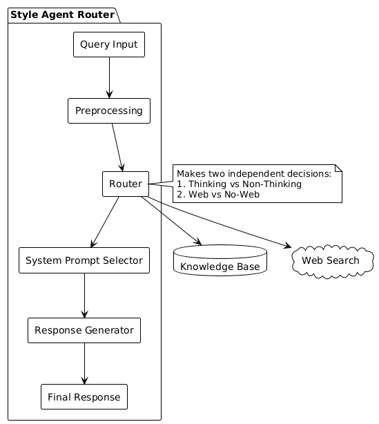

This project designs a routing mechanism that classifies user queries along two independent dimensions:

1. Thinking vs Non-Thinking: Whether the query requires multi-step reasoning
2. Web vs No-Web: Whether the query requires current information from the web

### Project Structure
```text
chatgpt-style-agent-router/
├── README.md
├── routing_logic.md
├── system_prompts.md
├── examples.md
└── (optional) router.py
```

## Architecture

The system follows a clear architectural flow:

1. **Query Analysis**: User queries are preprocessed to identify key elements
2. **Routing Decision**: The query is classified along the two dimensions
3. **System Prompt Selection**: The appropriate template is selected based on routing
4. **Response Generation**: The assistant generates a response using the selected prompt



## Routing Logic

The routing decision process follows these steps:

1. **Query Preprocessing**: Tokenization, entity identification, and intent detection
2. **Thinking Classification**: Determining if multi-step reasoning is required
3. **Web Classification**: Determining if current information is needed
4. **Special Case Handling**: Addressing safety, capability, and ambiguity issues
For more details, see `routing_demo.md`

## System Prompts

The project includes four system prompt templates, each designed for a specific routing combination:

1. **Template 1**: Thinking + Web
2. **Template 2**: Thinking + No-Web
3. **Template 3**: Non-Thinking + Web
4. **Template 4**: Non-Thinking + No-Web
For detailed instructions on each template, see `system_prompts.md`

## Examples

The project includes 10 comprehensive examples demonstrating how the routing system handles different types of queries.

## Measuring and Improving Routing Quality

### Direct Measurement Approaches

1. **User Feedback Mechanisms**
   - Implement rating systems for responses
   - Collect explicit feedback on routing appropriateness
   - Track "Was this helpful?" metrics
   - Monitor user satisfaction scores

2. **Automated Evaluation**
   - Develop test suites with known optimal routing decisions
   - Compare routing decisions against expert human judgments
   - Track accuracy metrics for different query categories

3. **A/B Testing Framework**
   - Test different routing criteria with similar queries
   - Compare user satisfaction between different routing approaches
   - Optimize routing thresholds based on performance data

### Indirect Quality Indicators

1. **Conversation Analysis**
   - Monitor follow-up question patterns (indicative of incomplete answers)
   - Measure time to resolution
   - Analyze query reformulation patterns

2. **Response Quality Metrics**
   - Evaluate response relevance and completeness
   - Assess user engagement with responses
   - Track correction or clarification requests
   - Monitor response time vs. quality trade-offs

### Continuous Improvement Strategies

1. **Feedback Loops**
   - Implement mechanisms to learn from user interactions
   - Use ML to identify patterns in successful routing
   - Regularly update routing criteria based on performance data
   - Create systems to automatically flag potential routing errors
   - Apply reinforcement learning concepts to adjust routing heuristics over time

2. **Edge Case Analysis**
   - Identify common failure patterns
   - Develop specialized handling for problematic query types

3. **Contextual Enhancement**
   - Incorporate conversation history into routing decisions
   - Consider user preferences and past interactions

4. **Expert Review Process**
   - Regular audits by domain experts
   - Establish quality benchmarks for routing decisions
   - Create guidelines for handling ambiguous cases

### Implementation Roadmap

1. **Initial Phase**
   - Implement basic user feedback collection
   - Create a test suite of representative queries
   - Establish baseline routing accuracy metrics
   - Set up automated monitoring of key indicators

2. **Development Phase**
   - Develop machine learning models to predict optimal routing
   - Implement A/B testing framework
   - Create tools for edge case analysis
   - Build feedback processing systems

3. **Maturation Phase**
   - Implement contextual routing based on conversation history
   - Develop user-specific routing adaptations
   - Create advanced analytics dashboards
   - Establish continuous improvement processes   