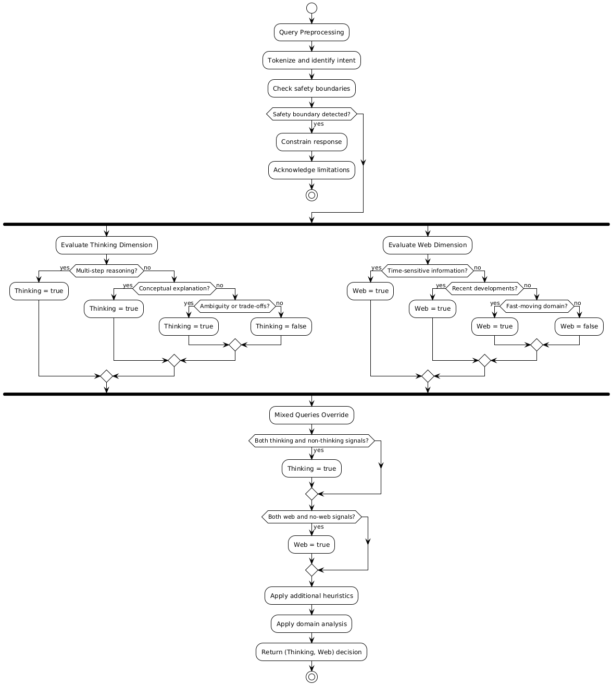

## Routing Decision Process
This document outlines the routing logic for our AI chatbot system.
The router classifies each user query along two dimensions:

1. Thinking vs Non-Thinking
2. Web vs No-Web

### Step 1: Query Preprocessing

Before making routing decisions, we perform basic preprocessing:
- Tokenize the query
- Identify key entities and intent
- Check for explicit time references
- Detect question types (what, why, how, etc.)

### Step 2: Thinking vs Non-Thinking Classification

#### Thinking = true
A query requires "Thinking" if it exhibits one or more of these characteristics:

1. **Multi-step Reasoning Indicators**
   - Questions with "why" or "how" followed by complex processes
   - Queries requiring analysis of cause and effect
   - Problems needing evaluation of multiple factors
   - Questions asking for explanations of mechanisms

2. **Ambiguity or Trade-offs**
   - Queries with "compare," "versus," "pros and cons"
   - Questions asking for recommendations or decisions
   - Situations requiring weighing different options
   - Scenarios with no single correct answer

3. **Conceptual Explanations**
   - Requests to explain complex theories or concepts
   - Questions about abstract ideas
   - Queries requiring synthesis of information from multiple domains
   - Explanations of "how things work" at a fundamental level

#### Thinking = false
A query is "Non-Thinking" if it exhibits these characteristics:

1. **Simple Factual Queries**
   - Direct questions with specific answers
   - Definitions of terms
   - Basic facts or figures
   - Simple "what is" questions about concrete entities

2. **Direct Transformations**
   - Calculations or conversions
   - Translations or rephrasing
   - Formatting requests

3. **Procedural Answers**
   - Step-by-step instructions (when steps are standard)
   - Recipes or formulas
   - Standard procedures or protocols
   
### Step 3: Determine Web vs No-Web

#### Web = true
A query requires "Web" access if it exhibits these characteristics:

1. **Time-Sensitive Information**
   - Explicit time references: "current," "latest," "today," "recent"
   - Questions about recent events or developments
   - Queries about current prices, rates, or statistics
   - Information that changes frequently

2. **Recent Developments**
   - Questions about new products, technologies, or discoveries
   - Queries about recent news or current events
   - Information about recently published research
   - Updates to ongoing situations

3. **Fast-Moving Domains**
   - Technology trends and developments
   - Market information and financial data
   - Political or social developments
   - Current events

#### Web = false
A query can be answered "No-Web" if it exhibits these characteristics:
1. **Established Knowledge**
   - Historical information
   - Scientific principles and laws
   - Well-established facts
   - Literary or artistic analysis

2. **Timeless Information**
   - Mathematical concepts and proofs
   - Philosophical theories
   - Language fundamentals
   - General knowledge that doesn't change frequently

3. **Personal or Subjective Queries**
   - Requests for opinions 
   - Hypothetical scenarios
   - Personal advice based on general principles

## Heuristics and Rules

### Primary Heuristics

1. **Time Reference Check**
   - If query contains explicit time references → Web = true
   - If query is about historical events → Web = false

2. **Question Type Analysis**
   - "Why" questions → Thinking = true
   - "How" with complex processes → Thinking = true
   - "What is" with simple entities → Thinking = false
   - "Calculate" or "convert" → Thinking = false

3. **Domain Analysis**
   - Current events, news, finance → Web = true
   - Science, history, mathematics → Web = false
   - Philosophy, arts → Web = false

4. **Complexity Assessment**
   - Multiple concepts to connect → Thinking = true
   - Single concept or fact → Thinking = false
   - Requires evaluation of options → Thinking = true
   - Direct lookup → Thinking = false

### Special Cases

1. **Ambiguous Queries**
   - If query is ambiguous, default to Thinking = true
   - Consider asking for clarification if ambiguity affects routing

2. **Mixed Queries**
   - If query has both thinking and non-thinking elements → Thinking = true
   - If query has both web and no-web elements → Web = true

3. **Safety and Limitations**
   - Queries about personal data → Web = false (and acknowledge limitation)
   - Medical or legal advice → Thinking = true, Web = false 
   - Financial advice → Thinking = true, Web = true 

### Capability and Safety Boundary Check
Before applying routing heuristics, the router checks for capability and safety boundaries
(for example: access to personal data, private systems, real-time information, or external tools).
When such boundaries are detected, the router constrains the response and ensures the
assistant explicitly acknowledges its limitations and suggests safe alternatives.

The following diagram illustrates the routing decision flow:

